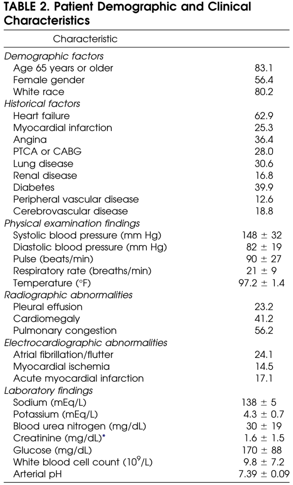

```{r setup, include=FALSE}
options(htmltools.dir.version = FALSE)
library(networkD3)
```
class: middle
# Some stats

- Paper cited 73 times (Google scholar)
- The journal: Academic Emergency Medicine, had an impact factor of 2.5 in 2015. 

---
class: middle
# Summary

__Goal:__ Predict patients who are at low risk for death or serious complications.

__Model:__ Classification tree

__Data:__ Emergency department visit information. 

---
# Background

Heart failure is very expensive to treat with an estimated $28 billion being spent at time of publication (2005).

As the population gets older it's expected that heart failure will become a bigger issue. 

The raw data for heart failure admissions around the country is very geographically skewed which masks individual predictors. 
---
# Data Source

The data for the article come from a two state-wide databases of emergency department treatment records. 

68,240 cases from 192 general acute care hospital emergency departments located within Pennsylvania.

Data on mortality was merged by the Pennsylvania department of health.

EDs were chosen because a large proportion of the patients that were admitted to the hospital with heart-failure were admitted through EDs. 

---
# Study Design

__Type:__
By pulling past data from medical records the paper is a retrospective cohort study. 

__Population:__ 
PA residents discharged in 1999 from PA emergency rooms with a diagnosis of heart failure according to ICD9 codes.

Hospital had to have at least one patient with a discharge of heart-failure for use. 

Chose ICD9 codes because it is "the only widely accepted clinical criteria" for heart failure.
---
# Exclusion Criteria

- Greater than 18 years of age.

- For individuals who had multiple admissions, only the first was kept.

- Patients needed to have pulse, sbp, and respirator rate available from their stay.

---
# Predictors

.center[

]

> We excluded from consideration variables not readily available in the ED...

This is a refreshing take on the variable selection process.

---
# Outcomes

.pull-left[
### Primary

> Inpatient death or the combination of inpatient death or serious medical complications that occured during the index hospitalization.

Basically if you died or you would have died if you weren't in the hospital, you counted as an outcome. 

]
.pull-right[
### Secondary

>  ...death from any cause within 30 days of the index ED admission and the first hospital readmission during this interval with a primary hospital discharge diagnosis of heart failure.

So 30 day survival and readmission for heart-failure. 
]

The primary outcome uses inpatient death instead of 30 day anytime death because it is "more relevant to ED providers."

---

.center[

]

---
# Model building

Computer would determine a split based upon a standard chi-square test. The researchers would then _manually decide_ if they liked the split or not. 

>  ...we split nodes using a combination that made the most clinical sense in an ED setting...

Why this was the choice and not just making sure your predictors were clinically relevant (which they supposedly did already) I have no idea. 

Data splitting was stopped when any of the following occurred: 
1. The adjusted p-value for all possible splits was .0.05 
2. A node contained fewer than 200 patients or, if split, resulted in a node containing
fewer than 100 patients 
3. The risk of death or complications was <2% in a node and <4% in all subsequent splits.

---
# Model Validation

... There was none

They didn't want to split their data up into train and test sets because they were scared they wouldn't have enough data.

The couldn't do CV because their model construction procedure was partially manual. 

These problems are briefly mentioned later in the limitations but mostly brushed off.

---
# Exclusion results

$n = 33,535$ after all exclusion criteria used.

```{r, fig.align='center', echo = FALSE}
nodes = data.frame("name" = 
 c(    
    "All Data",                        # 0
    "Had heart failure",               # 1
    "Not heart failure",               # 2 
    "No missing",                      # 3
    "Missing data",                    # 4
    "First hospitalization",           # 5
    "Second or later hospitalization", # 6
    "Died",     # 7
    "Medical complications", #8
    "No death or complications",       # 9
    "Negative outcome"             # 10
  ),
 "group" = c('kept', 'kept', 'excluded','kept', 'excluded','kept', 'excluded', 'kept', 'kept', 'kept', 'kept'  ))# Node 3

# Give a color for each group:
my_color <- 'd3.scaleOrdinal() .domain(["kept", "excluded"]) .range(["steelblue", "orangered"])'

links = as.data.frame(matrix(c(
 0, 1, 47107,           # overall to included 
 0, 2, (68240-47107),   # overall to exluded for heartrate
 1, 3, 43531,           # included after missing
 1, 4, (47107 - 43531), # excluded for missing
 3, 5, 33535,           # kept after first hospitalization
 3, 6, (43531 - 33535),  # not first hospitalization
 5, 7, 1498,    # 
 5, 8, 2269, 
 5, 9, 33535 - (1498 + 2269),
 7, 10, 1498, 
 8, 10, 2269
 ),
 byrow = TRUE, ncol = 3))

names(links) = c("source", "target", "value")

sankeyNetwork(Links = links, Nodes = nodes,
 Source = "source", Target = "target", NodeGroup = 'group', 
 Value = "value", NodeID = "name", width = 700,
 fontSize = 13, colourScale=my_color,
 sinksRight = T)
```

---
# Model results

Of the 33,533 patients, the model predicted that 5,758 were 'low risk'. 

Within this group, there were 19 deaths and 59 complications. 

They put confidence intervals on these percents with 'accounting for prediction error' which is not explained. 

.pull-left[

]
.pull-right[

]

---
# Discussion

They talk about the strength of their model in comparison to other similar models.
  - Mostly that it relies on ED available variables
  - They also say the tree is nice because it doesn't have complex equations
    - But then later they say that because their model is so complicated it may be good to use a computer to calculate it. 
    
They say the risk factors were in keeping with previous results.
  - This seems rather inevitable after they actively decided the splits. 


---
# Limitations

> We anticipate a similar pattern of performance for our heart failure clinical prediction rule. It would be premature to consider the rule ready for widespread application until its performance has been validated in a full complement of ED inpatients and outpatients and its safety demonstrated in controlled implementation trials.

They acknowledge the negatives of their model design. 

Why did they not pull another year's data? Also, why '99?


